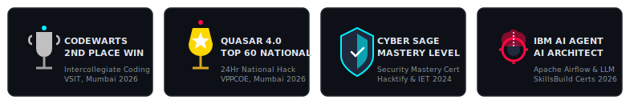
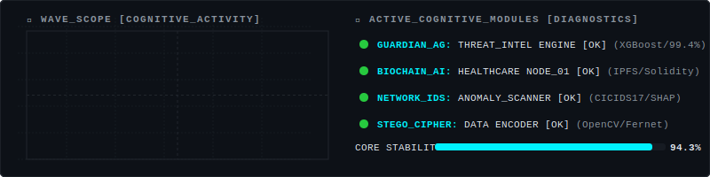

<!-- FUTURISTIC CYBERPUNK INTERACTIVE PROFILE TERMINAL // SEO OPTIMIZED -->
<!-- Designed with love by Antigravity (Digital Marketing & SEO Architecture) -->

  <!-- Animated Cyber Banner Header // SEO optimized Alt Text -->
  
  
    
  
  <!-- Main SEO Title (Contains Name, Primary & Secondary Roles) -->
  <h1>🧑‍💻 Adonis Jeswin | Full-Stack Engineer &amp; Cybersecurity Specialist</h1>
  
  <!-- Profile Views Badge (SEO and Social Proof) -->
  

    
  

  
  <!-- Subtitle & Professional Bio Summary -->
  <h3>📡 SECURE CONNECTION ESTABLISHED // WELCOME TO MY DIGITAL PORTFOLIO</h3>
  
  

    Welcome to the secure terminal of <strong>Adonis Jeswin</strong>, a Computer Science and Engineering student at Xavier Institute of Engineering, Mumbai. I specialize in developing high-performance full-stack applications, Web3 smart contracts, and AI-driven security diagnostics (intrusion detection, threat modeling).
  

  
   
  
  <!-- Custom Trophies Section // High Authority Alt Text -->
  

  <!-- Streak Stats Widget (Verified Working) -->
  
  
    
  
  <!-- Quotes Widget (Verified Working Vercel instance) -->
  

 

<!-- INTERACTIVE TERMINAL DIRECTORY (COLLAPSIBLE TABS) -->
<h2 align="center">🎛️ SYSTEM CONTROL PANEL (CLICK TO QUERY MODULES)</h2>

 

<!-- MODULE 1: SYSTEM TELEMETRY -->

  
<h3>📂 [EXECUTE] Live Diagnostics &amp; Telemetry Scope</h3>

   

  

    <!-- Telemetry Scope SVG -->
    
  

  
   
  
  *Telemetry streams dynamically monitoring cognitive stack stability, active processes, and security threat vectors. Core systems healthy.*

 

<!-- MODULE 2: TECHNICAL INVENTORY -->

  
<h3>📂 [QUERY] Full-Stack Developer &amp; Cybersecurity Tech Stack</h3>

   

  ### 🧠 Programming Languages &amp; Databases
  - **High-Level Systems Language:** Python, C++, Java, C
  - **Frontend Web Standards:** JavaScript (ES6+), TypeScript, HTML5, CSS3
  - **Smart Contract Programming:** Solidity (Ethereum Virtual Machine - EVM)
  - **Relational &amp; Document Databases:** SQL (PostgreSQL, MySQL, SQLite), NoSQL (MongoDB Atlas)

  ---

  ### ⚡ Web Frameworks &amp; Mobile Runtimes
  - **Backend API Architectures:** Node.js, Express.js, FastAPI, Flask, Django
  - **Frontend Web Interfaces:** React 19, Next.js, Vite
  - **Cross-Platform Mobile Apps:** React Native (Expo)

  ---

  ### 🛡️ Artificial Intelligence, Machine Learning &amp; Security
  - **Heuristics &amp; Classification models:** XGBoost, scikit-learn, PyTorch
  - **Explainable AI (XAI) &amp; Search:** SHAP, FAISS (Vector Database / Similarity Search)
  - **Generative AI &amp; LLMs:** Sentence-Transformers, HuggingFace, Google Gemini API, Groq Cloud API
  - **Digital Security &amp; Cryptography:** OpenCV, Fernet PBKDF2-HMAC encryption, Information Security Auditing

  ---

  ### 🛠️ Developer Tools &amp; DevOps Pipelines
  - **Cloud Infrastructure &amp; Sockets:** Git, Docker Containers, AWS (Amazon Web Services), Vercel deployments
  - **Web3 Ecosystem tools:** Hardhat local blockchain environment, Truffle, MetaMask
  - **Data Engineering:** RESTful APIs, WebSockets, Pandas, BeautifulSoup (Web Scraping)

 

<!-- MODULE 3: PROJECTS DATABASE -->

  
<h3>📂 [QUERY] Software Engineering &amp; CyberSecurity Projects</h3>

   

  ### 🛡️ GuardianAG — Multi-Module Security Intelligence Platform
  > **Distributed microservices security platform aggregating 6 specialized Machine Learning models for real-time threat intelligence.**
  - **Core Tech Stack:** Python, Flask, FastAPI, React 19, Vite, XGBoost, SHAP, HuggingFace Transformers
  - **SEO Heuristics:** Considers 66+ VirusTotal vendor feeds for threat classification; features URL detection, prompt injection protection, deepfake identification, and adaptive detection algorithms.
  
  ---
  
  ### 🌐 BioChainAI 2.0 — Decentralized Healthcare Ecosystem
  > **EHR management platform integrating Ethereum blockchain smart contracts and generative AI diagnostic assistants.**
  - **Core Tech Stack:** React, Vite, FastAPI, Solidity, Hardhat, MongoDB Atlas, IPFS/Pinata, Google Gemini API
  - **SEO Heuristics:** MetaMask Web3 signature authentication; patient records are encrypted on-chain and persisted globally in IPFS decentralized storage nodes.
  
  ---
  
  ### 🔐 Cryptographic Steganography Tool
  > **LSB (Least Significant Bit) steganography application secured by Fernet symmetric cryptography.**
  - **Core Tech Stack:** Python, Flask, OpenCV, Fernet Cryptography, Vercel Serverless
  - **SEO Heuristics:** Encrypts user payloads with 100K iterations of PBKDF2 key-derivation prior to image channel binary encoding.
  
  ---
  
  ### 📡 Network Anomaly Intrusion Detection System (IDS)
  > **Anomalous network traffic classifier mapping rolling-window risk scores and explainable security logs.**
  - **Core Tech Stack:** Python, Flask, React, Vite, scikit-learn, SHAP, Recharts
  - **SEO Heuristics:** Ensemble Isolation Forest and Autoencoder pipelines trained on 717MB CICIDS2017 benchmark dataset, using SHAP values to explain and justify network alerts.
  
  ---
  
  ### 🏗️ Construx — Unified Construction ERP &amp; Face Recognition
  > **Construction site manager dashboard with automated invoicing, milestones, and face biometric attendance.**
  - **Core Tech Stack:** Node.js, Express, Next.js, React Native (Expo), MongoDB, Razorpay API, DeepFace

 

<!-- MODULE 4: EXPERIENCE & DEPLOYMENTS -->

  
<h3>📂 [DUMP] Professional Internships &amp; Academic Logs</h3>

   

  ### 💼 Experience Sockets
  - **IBM SkillsBuild &amp; AICTE** — *Virtual AI &amp; Cloud Intern* (Jun 2026 – Jul 2026)
    - Deployed scalable AI Agents and multi-agent systems on AWS cloud infrastructure. Completed 6 IBM specialized certifications.
  - **Get AnalyticX** — *Data Analytics Intern* (Jun 2025 – Jul 2025)
    - Built automated Python web scraping pipelines with BeautifulSoup, feeding cricket scorecards into interactive Power BI dashboards.
  
  ---
  
  ### 🎓 Education Log
  - **Xavier Institute of Engineering, Mumbai** — *Bachelor of Engineering in Computer Science &amp; Engineering* (Expected Graduation: 2027)
    - **Current CGPA:** 8.17 / 10.0 // Achieved **9.43 SGPA** in Semester 6.
    - **Key Courses:** Data Structures &amp; Algorithms (DSA), DBMS, Network Security, Digital Forensics, Cryptography.

 

<!-- MODULE 5: COMM CHANNEL CONNECTIONS -->

  
<h3>📂 [INIT] Sockets, Contacts &amp; Social Channels</h3>

   

  Select a communication socket or copy the credentials directly below:
  
  *   **💼 LinkedIn Profile:** [linkedin.com/in/adonis-jeswin](https://linkedin.com/in/adonis-jeswin) — *Connect for professional opportunities and updates.*
  *   **📧 Email Compose:** [adonisjeswin01@gmail.com](https://mail.google.com/mail/?view=cm&amp;fs=1&amp;to=adonisjeswin01@gmail.com) — *Pre-fills a compose window on Gmail Web (or use standard mailto: [adonisjeswin01@gmail.com](mailto:adonisjeswin01@gmail.com)).*
  *   **🐙 GitHub Hub:** [github.com/AdonisJeswin](https://github.com/AdonisJeswin) — *Explore secure code repositories and active commits.*

   
  
  

    
    &nbsp;&nbsp;&nbsp;&nbsp;
    
    &nbsp;&nbsp;&nbsp;&nbsp;
    
  

  <!-- SYSTEM TELEMETRY SNAKE GRAPH (AUTOMATED WORKFLOW OUTPUT) -->
  <h3>👾 Live GitHub Contribution Activity Snake Grid</h3>
  <picture>
    <source media="(prefers-color-scheme: dark)" srcset="https://raw.githubusercontent.com/AdonisJeswin/AdonisJeswin/output/github-contribution-grid-snake-dark.svg">
    <source media="(prefers-color-scheme: light)" srcset="https://raw.githubusercontent.com/AdonisJeswin/AdonisJeswin/output/github-contribution-grid-snake.svg">
    
  </picture>
  
<i>This graphical timeline displays daily GitHub contributions compiled automatically by a scheduled actions agent.</i>

<!-- SEO Node Verified -->
